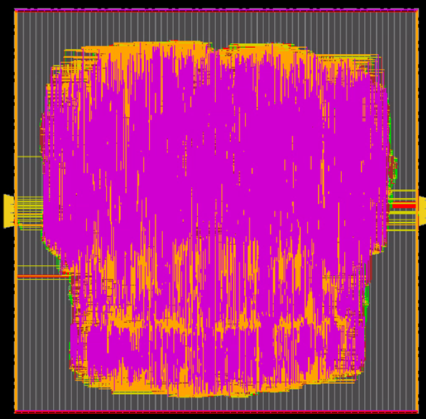

# Image Processing and Display Controller (IPDC)

## Overview

This project implements a simple Image Processing and Display Controller (IPDC) in Verilog

The controller loads RGB image data, performs multiple image processing operations, and outputs processed pixels through a display interface. The design was verified through simulation, logical synthesis, and physical synthesis.

## Features

### Image Loading
- Loads a 16×16 image (256 pixels).
- Stores pixel values in separate RGB registers.
- Uses an image counter to track loading progress.
- Maintains input readiness during loading.

### Image Shifting
Supports:
- Shift Up
- Shift Down
- Shift Left
- Shift Right

Implementation:
- Updates image origin coordinates (`origin_row`, `origin_column`).
- Prevents out-of-bounds movement.
- Automatically updates display coordinates.

### Image Scaling
Supports multiple display resolutions:
- Full size
- Reduced size levels

Implementation:
- Adjusts `image_size`.
- Updates display matrix dimensions.
- Modifies step size for correct pixel traversal.

### Median Filtering
Implements a 3×3 median filter:
- Collects neighboring pixel values.
- Out-of-bound pixels are treated as zero.
- Uses comparison and swap operations to determine the median.
- Processes RGB channels independently.

### RGB to YCbCr Conversion

Converts RGB pixels into YCbCr format using fixed-point arithmetic:
- Scaled coefficients for integer arithmetic.
- Implemented using shifts and additions.
- Avoids intermediate truncation errors.

### Census Transform
Generates a binary descriptor of local image structure.

- Compares neighboring pixels with the center pixel.
- Outputs:
  - 1 if neighbor > center
  - 0 otherwise
- Concatenates results into a census bit pattern.

### Display Controller
- Traverses the display matrix.
- Outputs processed pixel values.
- Supports multiple output modes depending on opcode.
- Generates valid output signaling.

### Final Physical Design

### Timing Results

The final design meets timing requirements:

| Metric        | Value       |
| ------------- | ----------- |
| Required Time | 1999.843 ps |
| Arrival Time  | 1976.270 ps |
| Slack         | 23.573 ps   |

**Timing Status:** MET

### Power Results

| Metric      | Value    |
| ----------- | -------- |
| Total Power | 25.19 mW |

### Area Results

The final physical implementation consists of approximately **140,540 standard-cell instances** with a total synthesized area of **215,060.365 μm²**.

| Metric               | Value           |
| -------------------- | --------------- |
| Total Instance Count | 140,540         |
| Total Cell Area      | 215,060.365 μm² |

## Tools Used

- Verilog HDL
- Synopsys Design Compiler
- Synopsys Verdi
- Cadence Innovus